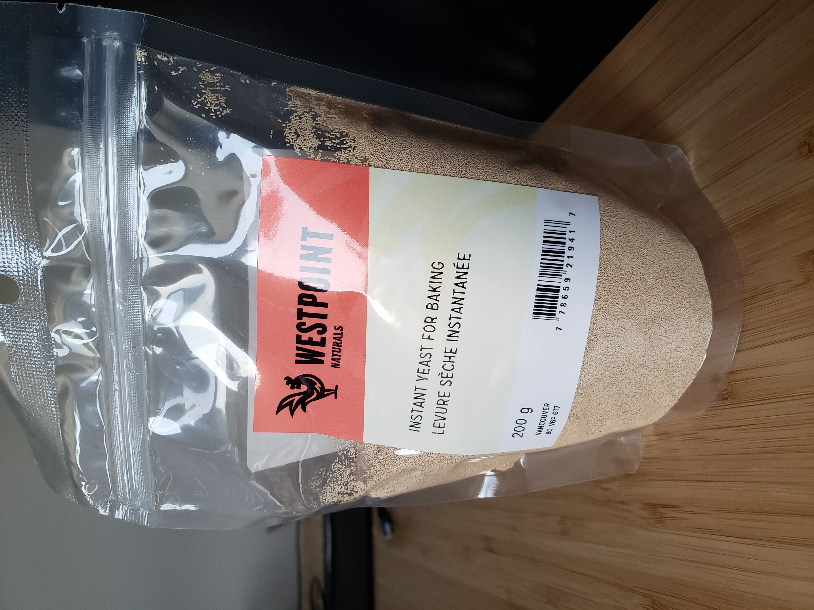
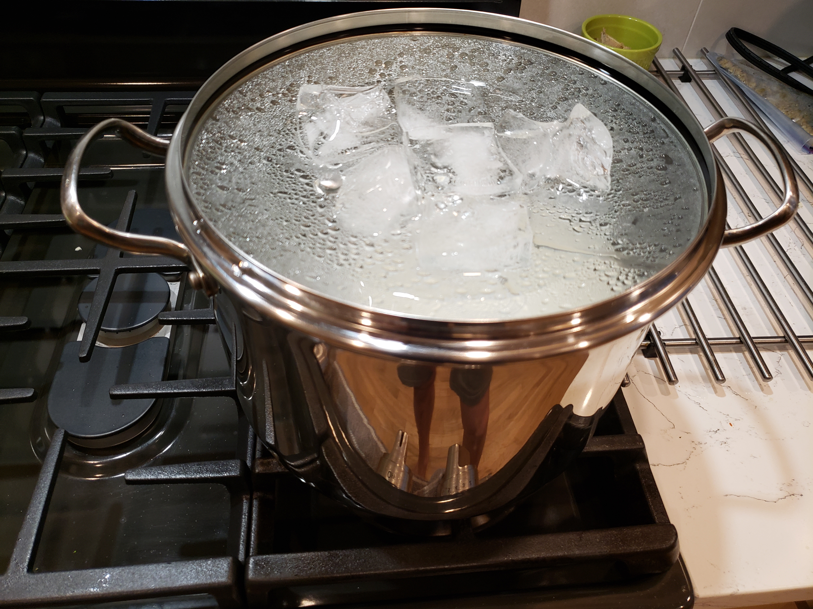

Since COVID-19 has hit our local communities, I have been increasinly bored from all the time I am spending at home. So to fuel my curiosity for free alcohol, I decided to try and make a sugar wash, hoping for some alcohol percentage between 5% and 15%. 

#### Ingredients and Materials
 - Ice cubes
 - Table sugar (sucrose)
 - Suvee cooker
 - Tap Water
 - Cooking pot
 - Glass cup
 - Instant / Active yeast

I used store-bought "Westpoint Naturals Instant Yeast", table sugar (sucrose) at home, a suvee cooker for a water bath, and also tap water.

First of all, I wanted to distill the water to remove contaminants and increase the alcohol percentage. I did this by taking a pot, filling it with water till half full and placing a bowl on top of the water (make sure it floats), then placing the lid **inverted** onto the pot. Bringing the water to a boil, I then placed the ice cubes on the top of the boiling pot lid, allowing for condensation to quickly happen and collect the distilled water onto the floating bowl.

With the distilled water, it was time to start the sugar wash. Since this was a trial run, I used 25g of sugar and 75mL of warm distilled water. After mixing them together, I put an excess amount of yeast in, and brought the 

At the heart of the struggle are two very different ideas of success—survival-driven and soul-driven. For survivalists, success is security, pragmatism, power over others. Success is the absence of material suffering, the nourishing of the soul be damned. It is an odd and ironic thing that most of the material power in our world often resides in the hands of younger souls. Still working in the egoic and material realms, they love the sensations of power and focus most of their energy on accumulation. Older souls tend not to be as materially driven. They have already played the worldly game in previous lives and they search for more subtle shades of meaning in this one—authentication rather than accumulation. They are often ignored by the culture at large, although they really are the truest warriors.

A soulful notion of success rests on the actualization of our innate image. Success is simply the completion of a soul step, however unsightly it may be. We have finished what we started when the lesson is learned. What a fear-based culture calls a wonderful opportunity may be fruitless and misguided for the soul. Staying in a passionless relationship may satisfy our need for comfort, but it may stifle the soul. Becoming a famous lawyer is only worthwhile if the soul demands it. It is an essential failure if you are called to be a monastic this time around. If you need to explore and abandon ten careers in order to stretch your soul toward its innate image, then so be it. Flake it till you make it.
