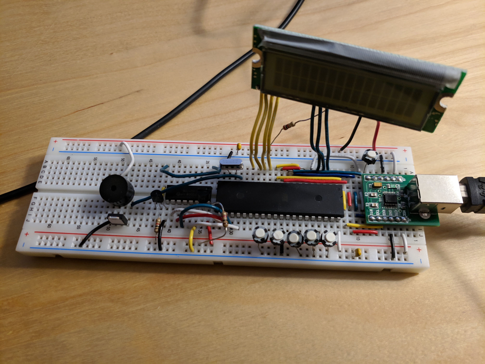

[Code (.asm)](https://github.com/tangnicholas/Assembly-C-Projects/blob/master/Labs/TempSensor.asm) and corresponding [plot (.py)](https://github.com/tangnicholas/Assembly-C-Projects/blob/master/Labs/TempSensor_Py.py)

{: .mx-auto.d-block :}