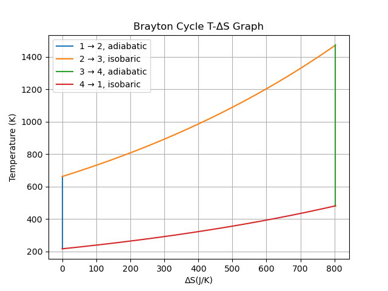

### Python plot of a Brayton Cycle



```python
import numpy
import matplotlib.pyplot as plt

# Constants
K_conversion = 273.15
T_amb = K_conversion-56.5   # ambient temperature K = -56.5 C
T_max = K_conversion+1200   # maximum temperature K = 1200 C
gamma = 1.4                 # specific heat ratio of air
R = 8.314                   # gas constant J/mol/K
P_0 = 22.6*10**3            # initial pressure Pa
P_ratio = 50                # pressure ratio between P1 and P2
N = 1000                    # number of samples per stage of the Brayton Cycle
m = 1                       # kg of air
S0 = 0                      # referece point of entropy J/K
mm = 28.962/10**3           # moler mass of air in kg/mol
n = m/mm                    # number of moles of air in 1kg
V_0 = n*22.4/1000           # volume of n moles of air         
cp = n*7/2*R                # Cp value

# Brayton Cycle
# 1. Adiabatic T increase (No increase in entropy)
T1 = numpy.full(N, T_amb, dtype=float)
S1 = numpy.full(N, S0, dtype=float)
P1 =  numpy.linspace(P_0, P_0*P_ratio, N, dtype=float, endpoint=True)
T1[1:] = T1[0] / (P1[0] / P1[1:])**(1-1/gamma)     # Rearranged using PV^gamma and TV^(gamma-1) for an expression in terms of P

# 2. Isobaric S increase (Linear T increase)
T2 = numpy.linspace(T1[-1], T_max, N, dtype=float, endpoint=True)
S2 = numpy.full(N, S0, dtype=float)
S2[1:] = S2[0] + cp * numpy.log(T2[1:] / T1[-1])   # the other portion of the deltaS equation = 0

# 3. Adiabatic T decrease (No increase in entropy)
S3 = numpy.full(N, S2[-1], dtype=float)
T3 =  numpy.full(N, T2[-1], dtype=float)
P3 =  numpy.linspace(P_0*P_ratio, P_0, N, dtype=float, endpoint=True)
T3[1:] = T3[0] / (P3[0] / P3[1:])**(1-1/gamma)

# 4. Isobaric S decrease (Linear T decrease)
T4 = numpy.linspace(T3[-1], T1[0], N, dtype=float, endpoint=True)
S4 = numpy.full(N, S3[0], dtype=float)
S4[1:] = S4[0] + cp * numpy.log(T4[1:] / T3[-1])


# Plot lines from data points
plt.plot(S1, T1, label='1 → 2, adiabatic')
plt.plot(S2, T2, label='2 → 3, isobaric')
plt.plot(S3, T3, label='3 → 4, adiabatic')
plt.plot(S4, T4, label='4 → 1, isobaric')
plt.legend(loc='best')

# Plot Temperature vs Entropy
plt.title("Q3 Brayton Cycle T-ΔS Graph")
plt.xlabel("ΔS(J/K)")
plt.ylabel("Temperature (K)")
#plt.ylim(-20, 55)
plt.legend(loc='upper left')
plt.grid(True)
plt.show()
```